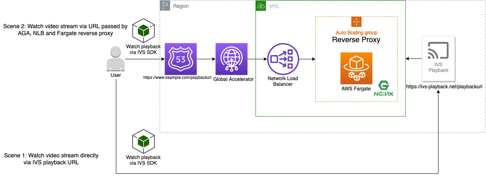

# AWS Serverless Reference Architecture for AWS Global Accelerator with Reverse Proxy


[Amazon Interactive Video Service(IVS)](https://aws.amazon.com/ivs/) is a managed live streaming solution that is quick and easy to set up, and ideal for creating interactive video experiences. It provides ultra-low latency (< 5s) service for video streaming.

Currently, Amazon IVS is not supported in some regions. We implement a serverless solution to serve the users in unsupported regions. [AWS Fargate](https://aws.amazon.com/fargate/) with the auto-scaling group and [Network Load Balancer (NLB)](https://aws.amazon.com/elasticloadbalancing/) are used to host a reverse proxy for IVS playback URL. [AWS Global Accelerator (AGA)](https://aws.amazon.com/global-accelerator) is used to reduce network latency and robust network stability

To achieve the ultra-low latency, the Amazon IVS player and HTTPS playback URL is required and NLB with a TLS certificate provided by [AWS Certificate Manager](https://aws.amazon.com/certificate-manager/).


# Why Reverse Proxy on AWS Fargate
AWS Fargate is a serverless compute service that helps container orchestration services such as Amazon ECS to provision containers without managing any EC2 instances. This repo aims to run Reverse Proxy in a serverless environment as a middle stack between AWS Global Accelerator and the endpoints you want to pass through the proxy.

# Benefits for AWS Global Accelerator
AWS Global Accelerator is a service that improves the availability and performance of your applications with local or global users. It provides static IP addresses that act as a fixed entry point to your application endpoints in a single or multiple AWS Regions, such as the Network Load Balancers (NLB) we used in this reference.

Example: [AGA Multiples Regions Endpoint Example](https://github.com/snese/aga-multiples-regions-exmaple)

# How to deploy
### Prerequisites

#### [Install AWS CLI and set up your own configuration](https://docs.aws.amazon.com/cli/latest/userguide/cli-chap-install.html)

#### Set up CDK Enviorment: 
```

# 1. Install CDK Toolkit
npm install -g aws-cdk

# 2. Clone the Repository
git clone https://github.com/snese/serverless-refarch-for-ga-proxy

# 3. Install required modules
cd serverless-refarch-for-ga-proxy
npm install

# 4. Bootstrapping an environment (If it is your first time to deploy AWS CDK App in the Region)
cdk bootstrap


```
#### Deployment:  

```
# Estimated deployment time: 5 min

# 1. Create a custom configuration of Nginx 
node ./lib/create-conf.js <your-proxy-url>


# 2. Deploy your CDK App
cdk deploy "*"

```

# License Summary
This library is licensed under the MIT-0 License. See the LICENSE file.
